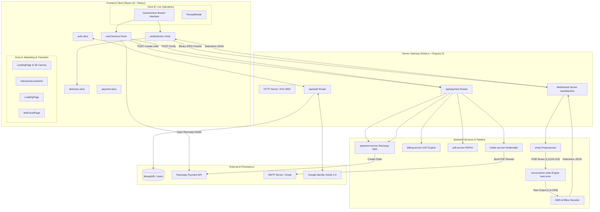

# System Design & Architecture: Smart Trolly 2.0

## 1. Overview

Smart Trolly 2.0 is an automated retail checkout and billing platform that uses computer vision to detect items placed in a shopping cart in real time. (Observed) The system captures a video stream from a client camera, processes individual frames through a server-hosted ONNX machine learning model, maintains cart state with anti-duplication algorithms, computes real-time itemized tax and totals, and executes checkout through Razorpay with automated thermal PDF receipts sent via email. (Observed)

## 2. Architecture Pattern

The system implements a decoupled client-server layered architecture with dual-channel communication (HTTP REST + WebSockets) and a strict split-zone UI execution model: (Observed)

1. Presentation & Interaction Layer (Client): React 19 single-page application built on Vite, using Redux Toolkit for centralized client state, React Router 7 for route guards, and Tailwind CSS v4 for UI styling. (Observed)
   - **Zone A (Marketing & Transition Surfaces)**: Interactive Landing Page with a lazy-loaded 3D holographic sensor node (`three`, `@react-three/fiber`, `@react-three/drei`), scroll-triggered animations (`framer-motion`), live cart simulation playground, hydration loading screen (`LoadingPage`), and 404 page (`NotFoundPage`). (Observed)
   - **Zone B (Live Operational Surfaces)**: `CameraView` execution surface governed by a strict 60 FPS performance budget with zero background 3D or competing animation loops during active WebSocket video frame streaming. (Observed)
2. API & Real-Time Gateway Layer (Server): Express 5 HTTP server paired with a `ws` WebSocket server bound to the same underlying Node.js HTTP listener. (Observed)
3. Domain Services & ML Inference Pipeline: Stateless business services handling ONNX tensor inference, Non-Maximum Suppression (NMS), GST billing calculations, PDFKit document generation, Nodemailer email delivery, and Razorpay payment integration. (Observed)
4. Persistence Layer: MongoDB managed via Mongoose ODM for user credentials and profile state. (Observed)

Evidence for classification:
- Separation of concerns: ML tensor manipulation (`detection.service.js`) and NMS algorithms (`nms.js`) are decoupled from route handlers and controllers. (Observed)
- Dedicated WebSocket protocol endpoint (`/ws/detection`) handling binary frame transmission separate from HTTP REST endpoints (`/api/auth/*`, `/api/payment/*`). (Observed)
- Code-split 3D bundle: `Trolley3DCanvas` is lazy-loaded via `React.lazy` and `Suspense`, preventing WebGL initialization from delaying initial marketing paint or impacting camera detection performance. (Observed)
- Unidirectional state management in the client using Redux slices (`auth.slice`, `detection.slice`, `payment.slice`) with async thunks bridging HTTP and WebSocket events. (Observed)

## 3. System Diagram



## 4. Core Components

### 4.1 Frontend Layer

#### `LandingPage.jsx`, `Trolley3DCanvas.jsx` & `InteractiveLiveDemo.jsx`
- Responsibility: Provides a high-converting, interactive visual entry point with product highlights, real-time interactive billing simulation, architectural workflow, and verified technical specifications. (Observed)
- Key Design Decisions:
  - Lazy-Loaded 3D Visual: Uses React Three Fiber and Drei in a separate dynamic bundle (`Trolley3DCanvas`) wrapped in `Suspense` with an animated placeholder fallback. (Observed)
  - Interactive Simulation: Allows visitors to test multi-item cart combinations, live GST tax slab additions (18% and 5%), and subtotal calculations directly in the browser without camera permissions. (Observed)
  - Scroll Interaction: Built with Framer Motion utilizing IntersectionObserver-backed transitions for performant viewport reveals. (Observed)

#### `LoadingPage.jsx` & `NotFoundPage.jsx`
- Responsibility: App-level transition state representation during session hydration in `AuthLayout.jsx` and on-brand 404 error recovery. (Observed)

#### `useDetection` Hook & `detection.slice`
- Responsibility: Manages the webcam hardware stream, frame sampling loop via an offscreen HTML5 canvas, WebSocket connection lifecycle, bounding box state, and temporal filtering algorithms. (Observed)
- Inbound Dependencies: Video element reference, canvas element reference, Redux dispatch. (Observed)
- Outbound Dependencies: `detection.api.js` (WebSocket transport), `detection.slice.js` actions. (Observed)
- Key Design Decisions:
  - Client-Side Sampling Rate: Fixed at 200ms (`CAPTURE_INTERVAL_MS = 200`) with JPEG quality 0.7 to balance network bandwidth against inference latency. (Observed)
  - Streak-Based Detection Debouncing: An item must appear for 3 consecutive frames (`CONSECUTIVE_FRAMES_REQUIRED = 3`) before being added to the cart, mitigating brief false-positive flickers. (Observed)
  - Re-add Cooldown: Enforces a 4000ms window (`RE_ADD_COOLDOWN_MS = 4000`) per product label so an item sitting in front of the lens does not continuously increment the cart. (Observed)
  - Lazy Audio Element Creation: The checkout audio beep (`/sounds/beep.mp3`) is initialized on first user interaction to comply with browser autoplay security policies. (Observed)

#### `useCheckout` Hook & `payment.slice`
- Responsibility: Orchestrates order initiation, dynamic third-party script loading for Razorpay, payment modal callbacks, signature verification dispatch, and receipt state transitions. (Observed)
- Inbound Dependencies: Shopping cart item labels array, current user profile. (Observed)
- Outbound Dependencies: `payment.api.js`, Razorpay SDK (`window.Razorpay`). (Observed)
- Key Design Decisions:
  - Dynamic Script Injection: `https://checkout.razorpay.com/v1/checkout.js` is loaded on demand if `window.Razorpay` is not present, avoiding blocking initial bundle load. (Observed)
  - Server-Derived Pricing: The client never computes order prices or GST amounts locally; all monetary calculations are requested from `/api/payment/preview` and `/api/payment/create-order`. (Observed)

#### `AuthLayout` & `auth.slice`
- Responsibility: Client-side routing guard that hydrates authentication status via cookie verification on initial render. (Observed)
- Key Design Decisions:
  - Distinguishes between `hydrating` (initial page boot check) and `loading` (form submission) to show full-screen skeleton spinners rather than flickering redirects. (Observed)

---

### 4.2 Backend Layer

#### Detection Subsystem (`detection.controller.js`, `detection.service.js`, `nms.js`)
- Responsibility: Loads the YOLOv8 ONNX model into memory at server boot, processes binary image payloads, transforms raw tensor output arrays into normalized coordinates, and filters bounding boxes. (Observed)
- Inbound Dependencies: Binary frame buffers received over WebSocket `/ws/detection`. (Observed)
- Outbound Dependencies: `onnxruntime-node`, `sharp`, `detection.config.js`. (Observed)
- Key Design Decisions:
  - Single In-Memory Model Instance: `loadModel()` is called once during `server.js` startup to prevent cold-start overhead per socket connection. (Observed)
  - Concurrency Lock & Server Throttle: Uses `MIN_FRAME_INTERVAL_MS = 200` and a boolean `processing` flag per socket instance to drop lagging client frames when inference latency spikes. (Observed)
  - Javascript-Level Non-Maximum Suppression: Because the ONNX model was exported with `end2end: false`, the model outputs raw anchor proposals `[1, 9, 1029]`. Decoding and greedy IoU suppression are implemented natively in JavaScript. (Observed)
  - CPU Execution Provider: Configured explicitly with `executionProviders: ["cpu"]` and `graphOptimizationLevel: "all"`. (Observed)

#### Billing Engine (`billing.service.js`)
- Responsibility: Pure functional calculation of FMCG GST tax breakdowns and line item subtotals. (Observed)
- Dependencies: `detection.config.js` (prices and class list). (Observed)
- Key Design Decisions:
  - Zero Side Effects: Independent of HTTP, database, and payment libraries, making it fully deterministic and reusable across preview, order creation, and PDF receipt rendering. (Observed)
  - GST Slabs: Maps FMCG product categories to standard Indian GST slabs (18% for biscuits/chocolates/toothpaste, 5% for coconut oil). (Observed)

#### Payment & Receipt Subsystem (`payment.controller.js`, `payment.service.js`, `pdf.service.js`, `mailer.service.js`)
- Responsibility: Razorpay order generation, HMAC SHA256 signature verification, PDF receipt rendering, and SMTP email dispatch. (Observed)
- Key Design Decisions:
  - Currency Conversion: Amounts in INR rupees are converted to paise (`Math.round(amount * 100)`) for Razorpay order creation. (Observed)
  - Thermal Print Specification: Receipts are rendered using `pdfkit` at 226pt width (standard 58mm/80mm thermal POS receipt width) with monospaced column layouts and dashed lines. (Observed)
  - Fire-and-Forget Email: After payment verification, PDF generation blocks the response to provide base64 data to the client, while `sendBillEmail` executes asynchronously so email transit latency does not delay the payment success response. (Observed)

## 5. Data Model

### Mongoose `users` Schema (`user.model.js`)

```javascript
// (Observed)
{
  username: { type: String, required: false, trim: true },
  email:    { type: String, unique: true, required: true },
  password: { type: String, select: false, required: function() { return !this.googleId; } },
  contact:  { type: String, required: false },
  googleId: { type: String, required: false },
  timestamps: true // createdAt, updatedAt
}
```

- Password Security: Pre-save hook hashes plain-text passwords with bcrypt using salt factor 12. (Observed)
- Conditional Password Requirement: Password validation is skipped if `googleId` is populated (OAuth accounts). (Observed)
- Identity Cardinality: `email` is enforced unique at the database index level. (Observed)

### In-Memory Structures (Non-Persisted)

1. `lastReceiptStore` (`payment.controller.js`):
   - Type: `Map<string, { pdfBuffer: Buffer, totalAmount: number }>`
   - Key: `userId` string.
   - Purpose: Cache the most recent receipt buffer for the `/api/payment/resend-receipt` endpoint without regenerating the PDF. (Observed)
   - Scope: Process memory only; clears on server restart. (Observed)

2. Detection Output Tensor Mapping:
   - Output Shape: `[1, 9, 1029]` (Observed)
   - Rows 0–3: `[cx, cy, w, h]` (Bounding box center coordinates and dimensions, normalized 0–1). (Observed)
   - Rows 4–8: Class probability scores corresponding to:
     - Index 0: `parle_g` (Observed)
     - Index 1: `good_day` (Observed)
     - Index 2: `colgate` (Observed)
     - Index 3: `dairy_milk` (Observed)
     - Index 4: `parachute` (Observed)

## 6. Cross-Cutting Concerns

| Concern | Implementation Mechanism | Consistency & Observations |
| :--- | :--- | :--- |
| **Authentication & Authorization** | JWT stored in HTTP-only, `sameSite: "strict"` cookie (`token`). `protect` middleware validates JWT and sets `req.user = { id }`. | Consistent across all `/api/payment/*` and `/api/auth/me` endpoints. (Observed) |
| **Third-Party Auth** | Passport.js Google OAuth 2.0 strategy (`passport-google-oauth20`). | Implemented for login/registration. Callback issues standard JWT cookie. (Observed) |
| **Input Validation** | Express Validator chains in `auth.validator.js`. | Used on `/api/auth/register`, `/api/auth/login`, `/api/auth/logout`. Payment endpoints use manual parameter checking. (Observed) |
| **Logging** | Morgan middleware in `dev` format for HTTP requests; standard `console.log`/`console.error` for WebSocket and service events. | Basic console output; no structured JSON logger (e.g. Winston/Pino) in place. (Observed) |
| **Error Handling** | Global Express error handler (`app.use((err, req, res, next) => ...)`), controller try/catch blocks returning standard `{ success: false, message }` JSON. | Centralized Express fallback exists, but WebSocket errors are handled independently within socket listeners. (Observed) |
| **Configuration** | Centralized `config.js` reading `dotenv`, performing fail-fast assertions on required variables on boot. | Fail-fast assertions enforce presence of all credentials (MongoDB, JWT, Google OAuth, Razorpay, SMTP) at process launch. (Observed) |

## 7. Known Inconsistencies & Tech Debt Signals

1. Non-Persistent Order History: (Observed)
   - Completed orders and transactions are not saved to a MongoDB `orders` or `transactions` collection. They exist only as transient state during the checkout session and within Razorpay's external dashboard.
2. In-Memory Receipt Cache: (Observed)
   - `lastReceiptStore` in `payment.controller.js` uses an in-memory JavaScript `Map`. If the backend process restarts or scales horizontally across multiple cluster nodes, `/resend-receipt` requests will fail with a 404 for existing sessions. (Documented in code comment: *"Production upgrade: persist in MongoDB Payment collection"*).
3. Hardcoded Callback Redirect: (Observed)
   - In `backend/src/controllers/auth.controller.js` line 124, `googleCallback` contains a hardcoded redirect: `res.redirect("http://localhost:5173/")`, rather than utilizing environment configuration or client origin headers.
4. Incomplete Static Asset Reference: (Observed)
   - `useDetection.js` attempts to play `/sounds/beep.mp3`. If this static file is absent from `frontend/public/sounds/`, the audio call fails silently inside the `.catch()` block.
5. Class-Agnostic NMS Overlap Suppression: (Observed)
   - The greedy NMS algorithm in `nms.js` suppresses any bounding box with IoU > 0.45 regardless of whether the predicted classes match, which can suppress adjacent distinct items if their proposals overlap significantly.

## 8. Trade-offs and Constraints

1. Server-Side vs Client-Side Inference: (Observed & Inferred)
   - *Decision*: Host ONNX model on Node.js backend via WebSockets rather than in-browser via ONNX Runtime Web / WebGL / WebGPU.
   - *Trade-off*: Introduces network overhead (streaming 5 frames/sec per client) and server CPU load, but protects intellectual property (the trained `.onnx` weight file is never exposed to the client) and avoids requiring high-end client GPU capabilities. (Inferred)
2. Manual NMS vs End-to-End Model Export: (Observed)
   - *Decision*: Decoded anchors and calculated IoU manually in JavaScript.
   - *Trade-off*: Slower execution than native C++ or ONNX operators, but allows fine-tuning `CONFIDENCE_THRESHOLD` (0.70) and `IOU_THRESHOLD` (0.45) directly in `detection.config.js` without re-exporting the model graph. (Observed)
3. Fixed Product Catalog vs Dynamic Inventory: (Observed)
   - *Decision*: Fixed mapping of 5 classes with prices in `detection.config.js`.
   - *Trade-off*: Extremely low latency (no database lookup per detected item), but requires code changes and server redeployment to adjust product pricing or add inventory items. (Observed)

## 9. Open Questions for the Team

- Data Persistence Strategy: Should an `Order` / `Transaction` schema be introduced in MongoDB to store transaction history, audit trails, and itemized invoice records? (Undocumented)
- Multi-Trolley Concurrency: The current WebSocket implementation assigns one connection per shopping session. How should the system handle multiple carts streaming simultaneously without saturating Node.js event loop CPU during ONNX inference? (Undocumented)
- Dynamic Product Catalog: Is there a roadmap to migrate `CLASS_PRICES` and `GST_RATES` from static config constants in `detection.config.js` to a database-backed catalog service? (Undocumented)
- Production OAuth Redirection: How should the Google OAuth redirect URL be dynamically resolved across development, staging, and production environments without hardcoded localhost URLs? (Undocumented)
